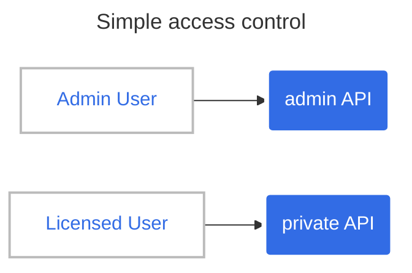

# Access Control

In this tutorial, we will see how to control access on APIs.

## Simple access control

At first, let's try to give and separate access between internal admin user and external user with a subscription.



First, we will deploy the _private_ app and the _admin_ app:

```shell
kubectl apply -f src/manifests/private-app.yaml
kubectl apply -f src/manifests/admin-app.yaml
```

Second, we can declare the API:

```yaml
---
apiVersion: hub.traefik.io/v1alpha1
kind: API
metadata:
  name: licensed-api
  namespace: apps
  labels:
    subscription: standard
spec:
  pathPrefix: "/weather/licensed/forecast"
  service:
    name: private-app
    port:
      number: 3000

---
apiVersion: hub.traefik.io/v1alpha1
kind: API
metadata:
  name: admin-api
  namespace: admin
spec:
  pathPrefix: "/admin"
  service:
    name: admin-app
    port:
      number: 3000
```

```shell
kubectl apply -f tutorials/3-access-control/apis.yaml
```

With those APIs, we will describe access on those APIs:

```yaml
---
apiVersion: hub.traefik.io/v1alpha1
kind: APIAccess
metadata:
  name: admin
spec:
  groups:
    - admin
  apis:
    - name: admin-api
      namespace: admin
---
apiVersion: hub.traefik.io/v1alpha1
kind: APIAccess
metadata:
  name: licensed
spec:
  groups:
    - licensed
  apiSelector:
    matchLabels:
      subscription: standard
```

```shell
kubectl apply -f tutorials/3-access-control/api-accesses.yaml
```


We can reference those access in the Gateway:

```yaml
apiVersion: hub.traefik.io/v1alpha1
kind: APIGateway
metadata:
  name: api-gateway
spec:
  apiAccesses:
    - admin
    - licensed
```

```shell
kubectl apply -f tutorials/3-access-control/api-gateway.yaml
```

### Test it

Now, we can test it with api token of users.

```shell
export API_GATEWAY_URL=$(kubectl get apigateways.hub.traefik.io api-gateway -o template --template '{{ .status.urls }}')
export ADMIN_USER_TOKEN=XXX
# This call is allowed.
curl -H "Authorization: Bearer ${ADMIN_USER_TOKEN}" "${API_GATEWAY_URL}/admin/" -w 'HTTP code: %{http_code}\n'
# This call is unauthorized
curl -H "Authorization: Bearer ${ADMIN_USER_TOKEN}" "${API_GATEWAY_URL}/weather/licensed/forecast" -w 'HTTP code: %{http_code}\n'
```

```shell
export LICENSED_USER_TOKEN=XXX
export API_GATEWAY_URL=$(kubectl get apigateways.hub.traefik.io api-gateway -o template --template '{{ .status.urls }}')
# This one is allowed
curl -H "Authorization: Bearer ${LICENSED_USER_TOKEN}" "${API_GATEWAY_URL}/weather/licensed/forecast/" -w 'HTTP code: %{http_code}\n'
# This one is unauthorized
curl -H "Authorization: Bearer ${LICENSED_USER_TOKEN}" "${API_GATEWAY_URL}/admin" -w 'HTTP code: %{http_code}\n'
```
